```r
knitr::opts_chunk$set(echo = T, cache = T, warning = F, message = F, tidy = T, size = "small")
rm(list = ls(all.names = TRUE))

library(dplyr)
```

```
## 
## Attaching package: 'dplyr'
```

```
## The following objects are masked from 'package:stats':
## 
##     filter, lag
```

```
## The following objects are masked from 'package:base':
## 
##     intersect, setdiff, setequal, union
```

```r
library(ggplot2)
library(gridExtra)
```

```
## 
## Attaching package: 'gridExtra'
```

```
## The following object is masked from 'package:dplyr':
## 
##     combine
```

```r
library(knitr)
library(rmarkdown)
library(survey)
```

```
## Loading required package: grid
```

```
## Loading required package: Matrix
```

```
## Loading required package: survival
```

```
## 
## Attaching package: 'survey'
```

```
## The following object is masked from 'package:graphics':
## 
##     dotchart
```

```r
library(tidyr)
```

```
## 
## Attaching package: 'tidyr'
```

```
## The following object is masked from 'package:Matrix':
## 
##     expand
```

```r
## flu-survey/code/data_prep.R
load("~/git/flu-survey/data/data_prep.RData")

## subset columns
df <- dataf[, c(1,4:27, 28:33, 92:111, 429)]
names(df)
```

```
##  [1] "CaseID"        "duration"      "PPAGE"         "ppagecat"     
##  [5] "ppagect4"      "PPEDUC"        "PPEDUCAT"      "PPETHM"       
##  [9] "PPGENDER"      "PPHHHEAD"      "PPHOUSE"       "PPINCIMP"     
## [13] "PPMARIT"       "PPMSACAT"      "PPREG4"        "ppreg9"       
## [17] "PPRENT"        "PPSTATEN"      "PPT01"         "PPT25"        
## [21] "PPT612"        "PPT1317"       "PPT18OV"       "PPWORK"       
## [25] "PPNET"         "Q1"            "Q2"            "Q3"           
## [29] "Q4"            "Q5"            "Q6"            "Q13"          
## [33] "Q14"           "Q15"           "Q16"           "Q17"          
## [37] "Q18_1"         "Q18_2"         "Q18_3"         "Q18_4"        
## [41] "Q18_5"         "Q18_6"         "Q18_7"         "Q18_8"        
## [45] "Q18_9"         "Q18_10"        "Q18_11"        "Q18_otherText"
## [49] "Q19"           "Q20"           "Q21"           "weight"
```


```r
## recode variables
library(car)

## use code function for response variables
## reset the "default" level on categorical variables
code <- function(col, map, ref) {
  relevel(as.factor(map[col]), ref=ref)
}

## income - PPINCIMP
income.map <- c(rep("under $10k", 3),
                rep("$10k to $25k", 4),
                rep("$25k to $50k", 4),
                rep("$50k to $75k", 2),
                rep("$75k to $100k", 2),
                rep("$100k to $150k", 2),
                rep("over $150k", 2))
df$income <- code(dataf$PPINCIMP, income.map, "under $10k")
income.lab <- c("under $10k", "$10k to $25k", "$25k to $50k", "$50k to $75k", "$75k to $100k", "$100k to $150k", "over $150k")
df$income <- factor(df$income, levels = income.lab)

## marital status - PPMARIT
marital.map <- c("single", "partnered", "partnered", "single", "single", "single")
df$marital <- code(dataf$PPMARIT, marital.map, "single")

## employment status - PPWORK
work.map <- c(rep("unemployed", 5),
              rep("employed", 2))
df$work <- code(dataf$PPWORK, work.map, "unemployed")

## check columns
colnames(df)
```

```
##  [1] "CaseID"        "duration"      "PPAGE"         "ppagecat"     
##  [5] "ppagect4"      "PPEDUC"        "PPEDUCAT"      "PPETHM"       
##  [9] "PPGENDER"      "PPHHHEAD"      "PPHOUSE"       "PPINCIMP"     
## [13] "PPMARIT"       "PPMSACAT"      "PPREG4"        "ppreg9"       
## [17] "PPRENT"        "PPSTATEN"      "PPT01"         "PPT25"        
## [21] "PPT612"        "PPT1317"       "PPT18OV"       "PPWORK"       
## [25] "PPNET"         "Q1"            "Q2"            "Q3"           
## [29] "Q4"            "Q5"            "Q6"            "Q13"          
## [33] "Q14"           "Q15"           "Q16"           "Q17"          
## [37] "Q18_1"         "Q18_2"         "Q18_3"         "Q18_4"        
## [41] "Q18_5"         "Q18_6"         "Q18_7"         "Q18_8"        
## [45] "Q18_9"         "Q18_10"        "Q18_11"        "Q18_otherText"
## [49] "Q19"           "Q20"           "Q21"           "weight"       
## [53] "income"        "marital"       "work"
```


```r
## ggplot templates
ptext <- theme(axis.text = element_text(size = rel(0.9)), axis.text.x = element_text(angle = 45, hjust = 1))
ptext2 <- ptext + theme(axis.text.x = element_blank())
```


```r
## create survey object
options(digits = 4)
options(survey.lonely.psu = "adjust")
des <- svydesign(ids = ~1, weights = ~weight, data = df[is.na(df$weight)==F, ])
```


# Q13. Do you get the flu vaccine?


```r
## Q13. Do you get the flu vaccine?
q13 <- as.data.frame(svytable(~Q13 + ppagecat + PPGENDER + PPETHM + income + PPEDUCAT + work + marital, des, round = T))

# univariate
p <- ggplot(q13, aes(Q13, weight = Freq)) + ptext
p + geom_bar() + ggtitle("Q13. Do you get the flu vaccine?")
```

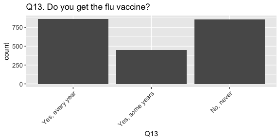<!-- -->

```r
# raw count
with(df, addmargins(table(Q13)))
```

```
## Q13
## Yes, every year Yes, some years       No, never             Sum 
##             908             423             819            2150
```

```r
# weighted count
as.data.frame(svytable(~Q13, des, round = T))
```

```
##               Q13 Freq
## 1 Yes, every year  837
## 2 Yes, some years  447
## 3       No, never  860
```


Significant p-values for Q13:
Age, education, ethnicity, housing type, income, marital status, metro status, region, rental status, employment status, internet 


## Ethnicity


```r
### Q13 and PPETHM: EXAMPLE

# chi-square: Q13 and PPETHM
svychisq(~Q13 + PPETHM, des)
```

```
## 
## 	Pearson's X^2: Rao & Scott adjustment
## 
## data:  svychisq(~Q13 + PPETHM, des)
## F = 2.6, ndf = 6.8, ddf = 15000.0, p-value = 0.01
```

```r
# glm: Q13 and PPETHM
a <- glm(Q13 ~ PPETHM, family = quasibinomial(link = "logit"), data = df, weights = weight)
summary(a)
```

```
## 
## Call:
## glm(formula = Q13 ~ PPETHM, family = quasibinomial(link = "logit"), 
##     data = df, weights = weight)
## 
## Deviance Residuals: 
##    Min      1Q  Median      3Q     Max  
## -2.407  -1.154   0.841   1.024   1.623  
## 
## Coefficients:
##                              Estimate Std. Error t value Pr(>|t|)    
## (Intercept)                    0.3312     0.0543    6.10  1.2e-09 ***
## PPETHMBlack, Non-Hispanic      0.3685     0.1444    2.55   0.0108 *  
## PPETHMHispanic                 0.3876     0.1301    2.98   0.0029 ** 
## PPETHMOther, Non-Hispanic      0.1638     0.1799    0.91   0.3627    
## PPETHM2+ Races, Non-Hispanic   0.4459     0.4172    1.07   0.2853    
## ---
## Signif. codes:  0 '***' 0.001 '**' 0.01 '*' 0.05 '.' 0.1 ' ' 1
## 
## (Dispersion parameter for quasibinomial family taken to be 0.9994)
## 
##     Null deviance: 2867.8  on 2149  degrees of freedom
## Residual deviance: 2853.4  on 2145  degrees of freedom
##   (18 observations deleted due to missingness)
## AIC: NA
## 
## Number of Fisher Scoring iterations: 4
```

```r
# unweighted table
as.data.frame(with(df, addmargins(table(PPETHM, Q13))))
```

```
##                    PPETHM             Q13 Freq
## 1     White, Non-Hispanic Yes, every year  696
## 2     Black, Non-Hispanic Yes, every year   69
## 3                Hispanic Yes, every year   80
## 4     Other, Non-Hispanic Yes, every year   36
## 5  2+ Races, Non-Hispanic Yes, every year   27
## 6                     Sum Yes, every year  908
## 7     White, Non-Hispanic Yes, some years  293
## 8     Black, Non-Hispanic Yes, some years   37
## 9                Hispanic Yes, some years   54
## 10    Other, Non-Hispanic Yes, some years   28
## 11 2+ Races, Non-Hispanic Yes, some years   11
## 12                    Sum Yes, some years  423
## 13    White, Non-Hispanic       No, never  567
## 14    Black, Non-Hispanic       No, never   88
## 15               Hispanic       No, never   94
## 16    Other, Non-Hispanic       No, never   29
## 17 2+ Races, Non-Hispanic       No, never   41
## 18                    Sum       No, never  819
## 19    White, Non-Hispanic             Sum 1556
## 20    Black, Non-Hispanic             Sum  194
## 21               Hispanic             Sum  228
## 22    Other, Non-Hispanic             Sum   93
## 23 2+ Races, Non-Hispanic             Sum   79
## 24                    Sum             Sum 2150
```

```r
# weighted proportions
(q <- svyby(~Q13, ~PPETHM, des, svymean, na.rm = T))
```

```
##                                        PPETHM Q13Yes, every year
## White, Non-Hispanic       White, Non-Hispanic             0.4180
## Black, Non-Hispanic       Black, Non-Hispanic             0.3319
## Hispanic                             Hispanic             0.3277
## Other, Non-Hispanic       Other, Non-Hispanic             0.3787
## 2+ Races, Non-Hispanic 2+ Races, Non-Hispanic             0.3149
##                        Q13Yes, some years Q13No, never
## White, Non-Hispanic                0.1976       0.3845
## Black, Non-Hispanic                0.1863       0.4818
## Hispanic                           0.2445       0.4279
## Other, Non-Hispanic                0.2834       0.3378
## 2+ Races, Non-Hispanic             0.1483       0.5367
##                        se.Q13Yes, every year se.Q13Yes, some years
## White, Non-Hispanic                  0.01298               0.01077
## Black, Non-Hispanic                  0.03437               0.02877
## Hispanic                             0.03194               0.03021
## Other, Non-Hispanic                  0.05190               0.04735
## 2+ Races, Non-Hispanic               0.05234               0.04173
##                        se.Q13No, never
## White, Non-Hispanic            0.01306
## Black, Non-Hispanic            0.03734
## Hispanic                       0.03443
## Other, Non-Hispanic            0.05178
## 2+ Races, Non-Hispanic         0.05747
```

```r
# plot: Q13. No, never
er <- geom_errorbar(aes(ymin = q[4] - q[7],
                        ymax = q[4] + q[7]), width = .25)
ggplot(q, aes(PPETHM, q[4])) + geom_point() + xlab("") + ylab("Q13No, never") + er + ggtitle(label = "") 
```

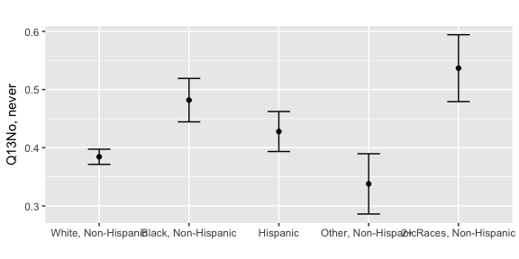<!-- -->

## Gender


```r
## Q13 and PPGENDER
svychisq(~Q13 + PPGENDER, des)
```

```
## 
## 	Pearson's X^2: Rao & Scott adjustment
## 
## data:  svychisq(~Q13 + PPGENDER, des)
## F = 0.88, ndf = 2, ddf = 4300, p-value = 0.4
```

```r
a <- glm(Q13 ~ PPGENDER, family = quasibinomial(link = "logit"), data = df, weights = weight)
summary(a)
```

```
## 
## Call:
## glm(formula = Q13 ~ PPGENDER, family = quasibinomial(link = "logit"), 
##     data = df, weights = weight)
## 
## Deviance Residuals: 
##    Min      1Q  Median      3Q     Max  
## -2.223  -1.196   0.809   1.008   1.613  
## 
## Coefficients:
##              Estimate Std. Error t value Pr(>|t|)    
## (Intercept)    0.4299     0.0611    7.03  2.7e-12 ***
## PPGENDERMale   0.0345     0.0886    0.39      0.7    
## ---
## Signif. codes:  0 '***' 0.001 '**' 0.01 '*' 0.05 '.' 0.1 ' ' 1
## 
## (Dispersion parameter for quasibinomial family taken to be 0.998)
## 
##     Null deviance: 2867.8  on 2149  degrees of freedom
## Residual deviance: 2867.6  on 2148  degrees of freedom
##   (18 observations deleted due to missingness)
## AIC: NA
## 
## Number of Fisher Scoring iterations: 4
```

```r
# unweighted table
as.data.frame(with(df, addmargins(table(PPGENDER, Q13))))
```

```
##    PPGENDER             Q13 Freq
## 1    Female Yes, every year  460
## 2      Male Yes, every year  448
## 3       Sum Yes, every year  908
## 4    Female Yes, some years  227
## 5      Male Yes, some years  196
## 6       Sum Yes, some years  423
## 7    Female       No, never  408
## 8      Male       No, never  411
## 9       Sum       No, never  819
## 10   Female             Sum 1095
## 11     Male             Sum 1055
## 12      Sum             Sum 2150
```

```r
# weighted props
(q <- svyby(~Q13, ~PPGENDER, des, svymean, na.rm = T))
```

```
##        PPGENDER Q13Yes, every year Q13Yes, some years Q13No, never
## Female   Female             0.3942             0.2178       0.3881
## Male       Male             0.3859             0.1984       0.4156
##        se.Q13Yes, every year se.Q13Yes, some years se.Q13No, never
## Female               0.01565               0.01359         0.01591
## Male                 0.01594               0.01356         0.01663
```

```r
# plot: Yes, every year
er <- geom_errorbar(aes(ymin = q[2] - q[5],
                        ymax = q[2] + q[5]), width = .25)
ggplot(q, aes(PPGENDER, q[2])) + geom_point() + xlab("") + ylab("Q13Yes, every year") + er + ggtitle(label = "")
```

<!-- -->

## Age


```r
## Q13 and ppagecat
svychisq(~Q13 + ppagecat, des)
```

```
## 
## 	Pearson's X^2: Rao & Scott adjustment
## 
## data:  svychisq(~Q13 + ppagecat, des)
## F = 14, ndf = 12, ddf = 25000, p-value <2e-16
```

```r
a <- glm(Q13 ~ ppagecat, family = quasibinomial(link = "logit"), data = df, weights = weight)
summary(a)
```

```
## 
## Call:
## glm(formula = Q13 ~ ppagecat, family = quasibinomial(link = "logit"), 
##     data = df, weights = weight)
## 
## Deviance Residuals: 
##    Min      1Q  Median      3Q     Max  
## -2.663  -1.040   0.778   0.959   2.025  
## 
## Coefficients:
##               Estimate Std. Error t value Pr(>|t|)    
## (Intercept)     1.0722     0.1439    7.45  1.3e-13 ***
## ppagecat25-34   0.0776     0.1890    0.41   0.6813    
## ppagecat35-44  -0.2679     0.1830   -1.46   0.1433    
## ppagecat45-54  -0.4767     0.1833   -2.60   0.0094 ** 
## ppagecat55-64  -0.9824     0.1734   -5.67  1.6e-08 ***
## ppagecat65-74  -1.4081     0.1890   -7.45  1.3e-13 ***
## ppagecat75+    -2.0832     0.2535   -8.22  3.5e-16 ***
## ---
## Signif. codes:  0 '***' 0.001 '**' 0.01 '*' 0.05 '.' 0.1 ' ' 1
## 
## (Dispersion parameter for quasibinomial family taken to be 1)
## 
##     Null deviance: 2867.8  on 2149  degrees of freedom
## Residual deviance: 2686.4  on 2143  degrees of freedom
##   (18 observations deleted due to missingness)
## AIC: NA
## 
## Number of Fisher Scoring iterations: 4
```

```r
# weighted props
(q <- svyby(~Q13, ~ppagecat, des, svymean, na.rm = T))
```

```
##       ppagecat Q13Yes, every year Q13Yes, some years Q13No, never
## 18-24    18-24             0.2550            0.29193       0.4531
## 25-34    25-34             0.2405            0.28392       0.4756
## 35-44    35-44             0.3091            0.23224       0.4587
## 45-54    45-54             0.3554            0.22773       0.4169
## 55-64    55-64             0.4775            0.14615       0.3763
## 65-74    65-74             0.5832            0.13574       0.2811
## 75+        75+             0.7332            0.06169       0.2051
##       se.Q13Yes, every year se.Q13Yes, some years se.Q13No, never
## 18-24               0.03427               0.03630         0.03944
## 25-34               0.02615               0.02802         0.03111
## 35-44               0.02676               0.02454         0.02934
## 45-54               0.02576               0.02255         0.02647
## 55-64               0.02377               0.01611         0.02328
## 65-74               0.02859               0.01974         0.02623
## 75+                 0.03990               0.02170         0.03680
```

```r
# unweighted table
as.data.frame(with(df, addmargins(table(ppagecat, Q13))))
```

```
##    ppagecat             Q13 Freq
## 1     18-24 Yes, every year   45
## 2     25-34 Yes, every year   73
## 3     35-44 Yes, every year  102
## 4     45-54 Yes, every year  138
## 5     55-64 Yes, every year  238
## 6     65-74 Yes, every year  201
## 7       75+ Yes, every year  111
## 8       Sum Yes, every year  908
## 9     18-24 Yes, some years   49
## 10    25-34 Yes, some years   82
## 11    35-44 Yes, some years   75
## 12    45-54 Yes, some years   86
## 13    55-64 Yes, some years   78
## 14    65-74 Yes, some years   45
## 15      75+ Yes, some years    8
## 16      Sum Yes, some years  423
## 17    18-24       No, never   78
## 18    25-34       No, never  134
## 19    35-44       No, never  147
## 20    45-54       No, never  160
## 21    55-64       No, never  181
## 22    65-74       No, never   93
## 23      75+       No, never   26
## 24      Sum       No, never  819
## 25    18-24             Sum  172
## 26    25-34             Sum  289
## 27    35-44             Sum  324
## 28    45-54             Sum  384
## 29    55-64             Sum  497
## 30    65-74             Sum  339
## 31      75+             Sum  145
## 32      Sum             Sum 2150
```

```r
# plot: Yes, every year
er <- geom_errorbar(aes(ymin = q[2] - q[5],
                        ymax = q[2] + q[5]), width = .25)
ggplot(q, aes(ppagecat, q[2])) + geom_point() + xlab("") + ylab("Q13Yes, every year") + er + ggtitle(label = "")
```

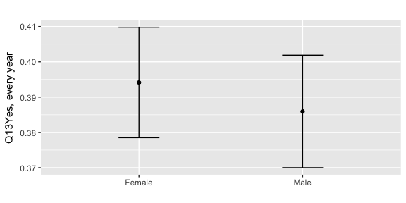<!-- -->


```r
## Q13 and ppagect4
svychisq(~Q13 + ppagect4, des)
```

```
## 
## 	Pearson's X^2: Rao & Scott adjustment
## 
## data:  svychisq(~Q13 + ppagect4, des)
## F = 25, ndf = 5.8, ddf = 13000.0, p-value <2e-16
```

```r
a <- glm(Q13 ~ ppagect4, family = quasibinomial(link = "logit"), data = df, weights = weight)
summary(a)
```

```
## 
## Call:
## glm(formula = Q13 ~ ppagect4, family = quasibinomial(link = "logit"), 
##     data = df, weights = weight)
## 
## Deviance Residuals: 
##    Min      1Q  Median      3Q     Max  
## -2.701  -1.021   0.793   0.966   2.087  
## 
## Coefficients:
##               Estimate Std. Error t value Pr(>|t|)    
## (Intercept)      1.124      0.109   10.31  < 2e-16 ***
## ppagect430-44   -0.232      0.145   -1.60     0.11    
## ppagect445-59   -0.662      0.139   -4.77  1.9e-06 ***
## ppagect460+     -1.517      0.138  -11.01  < 2e-16 ***
## ---
## Signif. codes:  0 '***' 0.001 '**' 0.01 '*' 0.05 '.' 0.1 ' ' 1
## 
## (Dispersion parameter for quasibinomial family taken to be 0.999)
## 
##     Null deviance: 2867.8  on 2149  degrees of freedom
## Residual deviance: 2700.4  on 2146  degrees of freedom
##   (18 observations deleted due to missingness)
## AIC: NA
## 
## Number of Fisher Scoring iterations: 4
```

```r
# weighted table
(q <- svyby(~Q13, ~ppagect4, des, svymean, na.rm = T))
```

```
##       ppagect4 Q13Yes, every year Q13Yes, some years Q13No, never
## 18-29    18-29             0.2452             0.3004       0.4544
## 30-44    30-44             0.2907             0.2381       0.4712
## 45-59    45-59             0.3864             0.2039       0.4097
## 60+        60+             0.5968             0.1150       0.2882
##       se.Q13Yes, every year se.Q13Yes, some years se.Q13No, never
## 18-29               0.02501               0.02697         0.02928
## 30-44               0.02184               0.02063         0.02441
## 45-59               0.02019               0.01649         0.02047
## 60+                 0.01949               0.01248         0.01815
```

```r
# unweighted table
as.data.frame(with(df, addmargins(table(ppagect4, Q13))))
```

```
##    ppagect4             Q13 Freq
## 1     18-29 Yes, every year   80
## 2     30-44 Yes, every year  140
## 3     45-59 Yes, every year  252
## 4       60+ Yes, every year  436
## 5       Sum Yes, every year  908
## 6     18-29 Yes, some years   95
## 7     30-44 Yes, some years  111
## 8     45-59 Yes, some years  135
## 9       60+ Yes, some years   82
## 10      Sum Yes, some years  423
## 11    18-29       No, never  143
## 12    30-44       No, never  216
## 13    45-59       No, never  260
## 14      60+       No, never  200
## 15      Sum       No, never  819
## 16    18-29             Sum  318
## 17    30-44             Sum  467
## 18    45-59             Sum  647
## 19      60+             Sum  718
## 20      Sum             Sum 2150
```

```r
# plot: Yes, every year
er <- geom_errorbar(aes(ymin = q[2] - q[5],
                        ymax = q[2] + q[5]), width = .25)
ggplot(q, aes(ppagect4, q[2])) + geom_point() + xlab("") + ylab("Q13Yes, every year") + er + ggtitle(label = "")
```

<!-- -->

## Education


```r
## Q13 and PPEDUCAT
svychisq(~Q13 + PPEDUCAT, des)
```

```
## 
## 	Pearson's X^2: Rao & Scott adjustment
## 
## data:  svychisq(~Q13 + PPEDUCAT, des)
## F = 8.6, ndf = 5.7, ddf = 12000.0, p-value = 5e-09
```

```r
a <- glm(Q13 ~ PPEDUCAT, family = quasibinomial(link = "logit"), data = df, weights = weight)
summary(a)
```

```
## 
## Call:
## glm(formula = Q13 ~ PPEDUCAT, family = quasibinomial(link = "logit"), 
##     data = df, weights = weight)
## 
## Deviance Residuals: 
##    Min      1Q  Median      3Q     Max  
## -2.344  -1.192   0.815   1.021   1.622  
## 
## Coefficients:
##                                     Estimate Std. Error t value Pr(>|t|)
## (Intercept)                            0.632      0.132    4.79  1.8e-06
## PPEDUCATHigh school                   -0.264      0.155   -1.71   0.0874
## PPEDUCATSome college                   0.106      0.158    0.67   0.5006
## PPEDUCATBachelor_s degree or higher   -0.436      0.154   -2.83   0.0047
##                                        
## (Intercept)                         ***
## PPEDUCATHigh school                 .  
## PPEDUCATSome college                   
## PPEDUCATBachelor_s degree or higher ** 
## ---
## Signif. codes:  0 '***' 0.001 '**' 0.01 '*' 0.05 '.' 0.1 ' ' 1
## 
## (Dispersion parameter for quasibinomial family taken to be 0.999)
## 
##     Null deviance: 2867.8  on 2149  degrees of freedom
## Residual deviance: 2843.3  on 2146  degrees of freedom
##   (18 observations deleted due to missingness)
## AIC: NA
## 
## Number of Fisher Scoring iterations: 4
```

```r
# weighted table
(q <- svyby(~Q13, ~PPEDUCAT, des, svymean, na.rm = T))
```

```
##                                                PPEDUCAT Q13Yes, every year
## Less than high school             Less than high school             0.3471
## High school                                 High school             0.4091
## Some college                               Some college             0.3234
## Bachelor_s degree or higher Bachelor_s degree or higher             0.4511
##                             Q13Yes, some years Q13No, never
## Less than high school                   0.1760       0.4769
## High school                             0.1358       0.4551
## Some college                            0.2657       0.4109
## Bachelor_s degree or higher             0.2396       0.3093
##                             se.Q13Yes, every year se.Q13Yes, some years
## Less than high school                     0.03873               0.03242
## High school                               0.02072               0.01497
## Some college                              0.01961               0.01958
## Bachelor_s degree or higher               0.01910               0.01674
##                             se.Q13No, never
## Less than high school               0.04153
## High school                         0.02121
## Some college                        0.02142
## Bachelor_s degree or higher         0.01797
```

```r
# unweighted table
as.data.frame(with(df, addmargins(table(PPEDUCAT, Q13))))
```

```
##                       PPEDUCAT             Q13 Freq
## 1        Less than high school Yes, every year   60
## 2                  High school Yes, every year  271
## 3                 Some college Yes, every year  218
## 4  Bachelor_s degree or higher Yes, every year  359
## 5                          Sum Yes, every year  908
## 6        Less than high school Yes, some years   27
## 7                  High school Yes, some years   79
## 8                 Some college Yes, some years  147
## 9  Bachelor_s degree or higher Yes, some years  170
## 10                         Sum Yes, some years  423
## 11       Less than high school       No, never   73
## 12                 High school       No, never  279
## 13                Some college       No, never  239
## 14 Bachelor_s degree or higher       No, never  228
## 15                         Sum       No, never  819
## 16       Less than high school             Sum  160
## 17                 High school             Sum  629
## 18                Some college             Sum  604
## 19 Bachelor_s degree or higher             Sum  757
## 20                         Sum             Sum 2150
```

```r
# plot: Yes, every year
er <- geom_errorbar(aes(ymin = q[2] - q[5],
                        ymax = q[2] + q[5]), width = .25)
ggplot(q, aes(PPEDUCAT, q[2])) + geom_point() + xlab("") + ylab("Q13Yes, every year") + er + ggtitle(label = "")
```

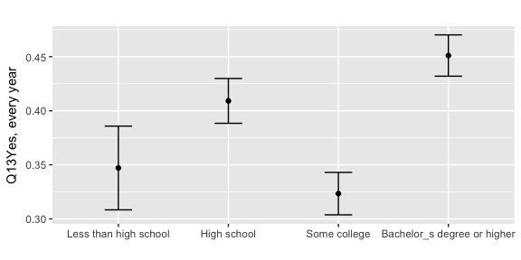<!-- -->

## Housing type


## Income


```r
## Q13 and income
svychisq(~Q13 + income, des)
```

```
## 
## 	Pearson's X^2: Rao & Scott adjustment
## 
## data:  svychisq(~Q13 + income, des)
## F = 4.2, ndf = 12, ddf = 26000, p-value = 1e-06
```

```r
a <- glm(Q13 ~ income, family = quasibinomial(link = "logit"), data = df, weights = weight)
summary(a)
```

```
## 
## Call:
## glm(formula = Q13 ~ income, family = quasibinomial(link = "logit"), 
##     data = df, weights = weight)
## 
## Deviance Residuals: 
##    Min      1Q  Median      3Q     Max  
## -2.447  -1.181   0.792   1.002   1.975  
## 
## Coefficients:
##                      Estimate Std. Error t value Pr(>|t|)    
## (Intercept)             0.984      0.207    4.76  2.0e-06 ***
## income$10k to $25k     -0.170      0.248   -0.68    0.494    
## income$25k to $50k     -0.476      0.228   -2.09    0.037 *  
## income$50k to $75k     -0.491      0.232   -2.11    0.035 *  
## income$75k to $100k    -0.489      0.237   -2.06    0.039 *  
## income$100k to $150k   -0.753      0.229   -3.29    0.001 ** 
## incomeover $150k       -1.098      0.251   -4.38  1.3e-05 ***
## ---
## Signif. codes:  0 '***' 0.001 '**' 0.01 '*' 0.05 '.' 0.1 ' ' 1
## 
## (Dispersion parameter for quasibinomial family taken to be 1)
## 
##     Null deviance: 2867.8  on 2149  degrees of freedom
## Residual deviance: 2831.9  on 2143  degrees of freedom
##   (18 observations deleted due to missingness)
## AIC: NA
## 
## Number of Fisher Scoring iterations: 4
```

```r
# weighted table
(q <- svyby(~Q13, ~income, des, svymean, na.rm = T))
```

```
##                        income Q13Yes, every year Q13Yes, some years
## under $10k         under $10k             0.2720             0.1695
## $10k to $25k     $10k to $25k             0.3069             0.1669
## $25k to $50k     $25k to $50k             0.3757             0.1920
## $50k to $75k     $50k to $75k             0.3791             0.2177
## $75k to $100k   $75k to $100k             0.3786             0.2428
## $100k to $150k $100k to $150k             0.4425             0.2331
## over $150k         over $150k             0.5284             0.1982
##                Q13No, never se.Q13Yes, every year se.Q13Yes, some years
## under $10k           0.5584               0.05007               0.04299
## $10k to $25k         0.5262               0.03100               0.02726
## $25k to $50k         0.4323               0.02440               0.02030
## $50k to $75k         0.4033               0.02539               0.02292
## $75k to $100k        0.3786               0.02890               0.02592
## $100k to $150k       0.3243               0.02462               0.02189
## over $150k           0.2734               0.03754               0.02991
##                se.Q13No, never
## under $10k             0.05651
## $10k to $25k           0.03480
## $25k to $50k           0.02546
## $50k to $75k           0.02642
## $75k to $100k          0.03005
## $100k to $150k         0.02348
## over $150k             0.03339
```

```r
# unweighted table
as.data.frame(with(df, addmargins(table(income, Q13))))
```

```
##            income             Q13 Freq
## 1      under $10k Yes, every year   24
## 2    $10k to $25k Yes, every year   83
## 3    $25k to $50k Yes, every year  178
## 4    $50k to $75k Yes, every year  168
## 5   $75k to $100k Yes, every year  131
## 6  $100k to $150k Yes, every year  213
## 7      over $150k Yes, every year  111
## 8             Sum Yes, every year  908
## 9      under $10k Yes, some years   15
## 10   $10k to $25k Yes, some years   36
## 11   $25k to $50k Yes, some years   81
## 12   $50k to $75k Yes, some years   78
## 13  $75k to $100k Yes, some years   74
## 14 $100k to $150k Yes, some years   99
## 15     over $150k Yes, some years   40
## 16            Sum Yes, some years  423
## 17     under $10k       No, never   50
## 18   $10k to $25k       No, never  118
## 19   $25k to $50k       No, never  183
## 20   $50k to $75k       No, never  158
## 21  $75k to $100k       No, never  106
## 22 $100k to $150k       No, never  146
## 23     over $150k       No, never   58
## 24            Sum       No, never  819
## 25     under $10k             Sum   89
## 26   $10k to $25k             Sum  237
## 27   $25k to $50k             Sum  442
## 28   $50k to $75k             Sum  404
## 29  $75k to $100k             Sum  311
## 30 $100k to $150k             Sum  458
## 31     over $150k             Sum  209
## 32            Sum             Sum 2150
```

```r
# plot: Yes, every year
er <- geom_errorbar(aes(ymin = q[2] - q[5],
                        ymax = q[2] + q[5]), width = .25)
ggplot(q, aes(income, q[2])) + geom_point() + xlab("") + ylab("Q13Yes, every year") + er + ggtitle(label = "") 
```

<!-- -->

## Marital status


```r
## Q13 and marital
svychisq(~Q13 + marital, des)
```

```
## 
## 	Pearson's X^2: Rao & Scott adjustment
## 
## data:  svychisq(~Q13 + marital, des)
## F = 12, ndf = 2, ddf = 4300, p-value = 6e-06
```

```r
a <- glm(Q13 ~ marital, family = quasibinomial(link = "logit"), data = df, weights = weight)
summary(a)
```

```
## 
## Call:
## glm(formula = Q13 ~ marital, family = quasibinomial(link = "logit"), 
##     data = df, weights = weight)
## 
## Deviance Residuals: 
##    Min      1Q  Median      3Q     Max  
## -2.377  -1.167   0.807   1.014   1.712  
## 
## Coefficients:
##                  Estimate Std. Error t value Pr(>|t|)    
## (Intercept)        0.6780     0.0692    9.80  < 2e-16 ***
## maritalpartnered  -0.4023     0.0903   -4.46  8.7e-06 ***
## ---
## Signif. codes:  0 '***' 0.001 '**' 0.01 '*' 0.05 '.' 0.1 ' ' 1
## 
## (Dispersion parameter for quasibinomial family taken to be 0.998)
## 
##     Null deviance: 2867.8  on 2149  degrees of freedom
## Residual deviance: 2847.7  on 2148  degrees of freedom
##   (18 observations deleted due to missingness)
## AIC: NA
## 
## Number of Fisher Scoring iterations: 4
```

```r
# unweighted table
as.data.frame(with(df, addmargins(table(marital, Q13))))
```

```
##      marital             Q13 Freq
## 1     single Yes, every year  302
## 2  partnered Yes, every year  606
## 3        Sum Yes, every year  908
## 4     single Yes, some years  160
## 5  partnered Yes, some years  263
## 6        Sum Yes, some years  423
## 7     single       No, never  374
## 8  partnered       No, never  445
## 9        Sum       No, never  819
## 10    single             Sum  836
## 11 partnered             Sum 1314
## 12       Sum             Sum 2150
```

```r
# weighted table
(q <- svyby(~Q13, ~marital, des, svymean, na.rm = T))
```

```
##             marital Q13Yes, every year Q13Yes, some years Q13No, never
## single       single             0.3367             0.1992       0.4641
## partnered partnered             0.4315             0.2157       0.3528
##           se.Q13Yes, every year se.Q13Yes, some years se.Q13No, never
## single                  0.01729               0.01512         0.01865
## partnered               0.01448               0.01239         0.01424
```

```r
# plot: Yes, every year
er <- geom_errorbar(aes(ymin = q[2] - q[5],
                        ymax = q[2] + q[5]), width = .25)
ggplot(q, aes(marital, q[2])) + geom_point() + xlab("") + ylab("Q13Yes, every year") + er + ggtitle(label = "") 
```

<!-- -->

## Metro status


```r
## Q13 and PPMSACAT
svychisq(~Q13 + PPMSACAT, des)
```

```
## 
## 	Pearson's X^2: Rao & Scott adjustment
## 
## data:  svychisq(~Q13 + PPMSACAT, des)
## F = 3.9, ndf = 2, ddf = 4300, p-value = 0.02
```

```r
a <- glm(Q13 ~ PPMSACAT, family = quasibinomial(link = "logit"), data = df, weights = weight)
summary(a)
```

```
## 
## Call:
## glm(formula = Q13 ~ PPMSACAT, family = quasibinomial(link = "logit"), 
##     data = df, weights = weight)
## 
## Deviance Residuals: 
##    Min      1Q  Median      3Q     Max  
## -2.215  -1.193   0.814   1.007   1.626  
## 
## Coefficients:
##                   Estimate Std. Error t value Pr(>|t|)    
## (Intercept)         0.4529     0.0480    9.43   <2e-16 ***
## PPMSACATNon-Metro  -0.0432     0.1235   -0.35     0.73    
## ---
## Signif. codes:  0 '***' 0.001 '**' 0.01 '*' 0.05 '.' 0.1 ' ' 1
## 
## (Dispersion parameter for quasibinomial family taken to be 0.998)
## 
##     Null deviance: 2867.8  on 2149  degrees of freedom
## Residual deviance: 2867.6  on 2148  degrees of freedom
##   (18 observations deleted due to missingness)
## AIC: NA
## 
## Number of Fisher Scoring iterations: 4
```

```r
# unweighted table
as.data.frame(with(df, addmargins(table(PPMSACAT, Q13))))
```

```
##     PPMSACAT             Q13 Freq
## 1      Metro Yes, every year  772
## 2  Non-Metro Yes, every year  136
## 3        Sum Yes, every year  908
## 4      Metro Yes, some years  376
## 5  Non-Metro Yes, some years   47
## 6        Sum Yes, some years  423
## 7      Metro       No, never  682
## 8  Non-Metro       No, never  137
## 9        Sum       No, never  819
## 10     Metro             Sum 1830
## 11 Non-Metro             Sum  320
## 12       Sum             Sum 2150
```

```r
# weighted table
(q <- svyby(~Q13, ~PPMSACAT, des, svymean, na.rm = T))
```

```
##            PPMSACAT Q13Yes, every year Q13Yes, some years Q13No, never
## Metro         Metro             0.3887             0.2191       0.3922
## Non-Metro Non-Metro             0.3990             0.1487       0.4524
##           se.Q13Yes, every year se.Q13Yes, some years se.Q13No, never
## Metro                   0.01208               0.01063         0.01241
## Non-Metro               0.02932               0.02135         0.03035
```

```r
# plot: Yes, every year
er <- geom_errorbar(aes(ymin = q[2] - q[5],
                        ymax = q[2] + q[5]), width = .25)
ggplot(q, aes(PPMSACAT, q[2])) + geom_point() + xlab("") + ylab("Q13Yes, every year") + er + ggtitle(label = "")
```

<!-- -->

## Region


```r
## Q13 and region4 and region9
svychisq(~Q13 + PPREG4, des)
```

```
## 
## 	Pearson's X^2: Rao & Scott adjustment
## 
## data:  svychisq(~Q13 + PPREG4, des)
## F = 3.5, ndf = 6, ddf = 13000, p-value = 0.002
```

```r
svychisq(~Q13 + ppreg9, des)
```

```
## 
## 	Pearson's X^2: Rao & Scott adjustment
## 
## data:  svychisq(~Q13 + ppreg9, des)
## F = 2.1, ndf = 16, ddf = 34000, p-value = 0.005
```

```r
a <- glm(Q13 ~ PPREG4, family = quasibinomial(link = "logit"), data = df, weights = weight)
summary(a)
```

```
## 
## Call:
## glm(formula = Q13 ~ PPREG4, family = quasibinomial(link = "logit"), 
##     data = df, weights = weight)
## 
## Deviance Residuals: 
##    Min      1Q  Median      3Q     Max  
## -2.265  -1.189   0.812   1.007   1.636  
## 
## Coefficients:
##                 Estimate Std. Error t value Pr(>|t|)    
## (Intercept)       0.4462     0.0957    4.66  3.4e-06 ***
## PPREG4Northeast  -0.0528     0.1407   -0.38     0.71    
## PPREG4South      -0.0208     0.1201   -0.17     0.86    
## PPREG4West        0.0764     0.1332    0.57     0.57    
## ---
## Signif. codes:  0 '***' 0.001 '**' 0.01 '*' 0.05 '.' 0.1 ' ' 1
## 
## (Dispersion parameter for quasibinomial family taken to be 0.999)
## 
##     Null deviance: 2867.8  on 2149  degrees of freedom
## Residual deviance: 2866.7  on 2146  degrees of freedom
##   (18 observations deleted due to missingness)
## AIC: NA
## 
## Number of Fisher Scoring iterations: 4
```

```r
b <- glm(Q13 ~ ppreg9, family = quasibinomial(link = "logit"), data = df, weights = weight)
summary(b)
```

```
## 
## Call:
## glm(formula = Q13 ~ ppreg9, family = quasibinomial(link = "logit"), 
##     data = df, weights = weight)
## 
## Deviance Residuals: 
##    Min      1Q  Median      3Q     Max  
## -2.290  -1.197   0.795   1.007   1.766  
## 
## Coefficients:
##                          Estimate Std. Error t value Pr(>|t|)    
## (Intercept)               0.62355    0.11869    5.25  1.6e-07 ***
## ppreg9East-South Central -0.31908    0.22439   -1.42   0.1552    
## ppreg9Mid-Atlantic       -0.30963    0.16791   -1.84   0.0653 .  
## ppreg9Mountain           -0.06657    0.19716   -0.34   0.7357    
## ppreg9New England         0.00931    0.24140    0.04   0.9692    
## ppreg9Pacific            -0.11942    0.16500   -0.72   0.4693    
## ppreg9South Atlantic     -0.11746    0.15476   -0.76   0.4480    
## ppreg9West-North Central -0.54066    0.20428   -2.65   0.0082 ** 
## ppreg9West-South Central -0.28076    0.17488   -1.61   0.1086    
## ---
## Signif. codes:  0 '***' 0.001 '**' 0.01 '*' 0.05 '.' 0.1 ' ' 1
## 
## (Dispersion parameter for quasibinomial family taken to be 1.001)
## 
##     Null deviance: 2867.8  on 2149  degrees of freedom
## Residual deviance: 2856.4  on 2141  degrees of freedom
##   (18 observations deleted due to missingness)
## AIC: NA
## 
## Number of Fisher Scoring iterations: 4
```

```r
# unweighted table
as.data.frame(with(df, addmargins(table(PPREG4, Q13))))
```

```
##       PPREG4             Q13 Freq
## 1    Midwest Yes, every year  203
## 2  Northeast Yes, every year  174
## 3      South Yes, every year  330
## 4       West Yes, every year  201
## 5        Sum Yes, every year  908
## 6    Midwest Yes, some years   91
## 7  Northeast Yes, some years   81
## 8      South Yes, some years  127
## 9       West Yes, some years  124
## 10       Sum Yes, some years  423
## 11   Midwest       No, never  182
## 12 Northeast       No, never  164
## 13     South       No, never  303
## 14      West       No, never  170
## 15       Sum       No, never  819
## 16   Midwest             Sum  476
## 17 Northeast             Sum  419
## 18     South             Sum  760
## 19      West             Sum  495
## 20       Sum             Sum 2150
```

```r
with(df, addmargins(table(Q13, ppreg9)))
```

```
##                  ppreg9
## Q13               East-North Central East-South Central Mid-Atlantic
##   Yes, every year                123                 51          132
##   Yes, some years                 61                 13           57
##   No, never                      137                 44          115
##   Sum                            321                108          304
##                  ppreg9
## Q13               Mountain New England Pacific South Atlantic
##   Yes, every year       70          42     131            180
##   Yes, some years       43          24      81             72
##   No, never             65          49     105            180
##   Sum                  178         115     317            432
##                  ppreg9
## Q13               West-North Central West-South Central  Sum
##   Yes, every year                 80                 99  908
##   Yes, some years                 30                 42  423
##   No, never                       45                 79  819
##   Sum                            155                220 2150
```

```r
# weighted table
(q <- svyby(~Q13, ~PPREG4, des, svymean, na.rm = T))
```

```
##              PPREG4 Q13Yes, every year Q13Yes, some years Q13No, never
## Midwest     Midwest             0.3903             0.1986       0.4111
## Northeast Northeast             0.4029             0.1977       0.3994
## South         South             0.3952             0.1739       0.4309
## West           West             0.3723             0.2813       0.3464
##           se.Q13Yes, every year se.Q13Yes, some years se.Q13No, never
## Midwest                 0.02339               0.01986         0.02426
## Northeast               0.02565               0.02116         0.02585
## South                   0.01867               0.01488         0.01947
## West                    0.02346               0.02261         0.02355
```

```r
(q2 <- svyby(~Q13, ~ppreg9, des, svymean, na.rm = T))
```

```
##                                ppreg9 Q13Yes, every year
## East-North Central East-North Central             0.3490
## East-South Central East-South Central             0.4245
## Mid-Atlantic             Mid-Atlantic             0.4222
## Mountain                     Mountain             0.3642
## New England               New England             0.3469
## Pacific                       Pacific             0.3766
## South Atlantic         South Atlantic             0.3761
## West-North Central West-North Central             0.4793
## West-South Central West-South Central             0.4151
##                    Q13Yes, some years Q13No, never se.Q13Yes, every year
## East-North Central             0.1981       0.4529               0.02757
## East-South Central             0.1232       0.4524               0.05004
## Mid-Atlantic                   0.1941       0.3837               0.03043
## Mountain                       0.2744       0.3613               0.03898
## New England                    0.2080       0.4451               0.04674
## Pacific                        0.2850       0.3384               0.02936
## South Atlantic                 0.1728       0.4511               0.02420
## West-North Central             0.1997       0.3210               0.04271
## West-South Central             0.1987       0.3862               0.03545
##                    se.Q13Yes, some years se.Q13No, never
## East-North Central               0.02440         0.02967
## East-South Central               0.03269         0.05160
## Mid-Atlantic                     0.02489         0.03023
## Mountain                         0.03761         0.03978
## New England                      0.03999         0.04942
## Pacific                          0.02828         0.02921
## South Atlantic                   0.01952         0.02573
## West-North Central               0.03407         0.04135
## West-South Central               0.02948         0.03595
```

```r
# plot: Yes, every year
er <- geom_errorbar(aes(ymin = q[2] - q[5],
                        ymax = q[2] + q[5]), width = .25)
ggplot(q, aes(PPREG4, q[2])) + geom_point() + xlab("") + ylab("Q13Yes, every year") + er + ggtitle(label = "") 
```

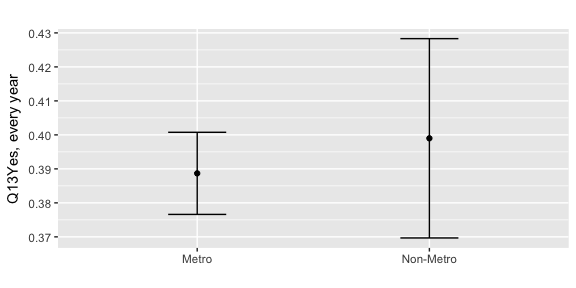<!-- -->

```r
er2 <- geom_errorbar(aes(ymin = q2[2] - q2[5],
                        ymax = q2[2] + q2[5]), width = .25)
ggplot(q2, aes(ppreg9, q2[2])) + geom_point() + xlab("") + ylab("Q13Yes, every year") + er2 + ggtitle(label = "") 
```

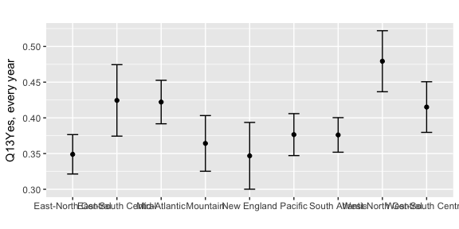<!-- -->

## Rental Status


## Employment status


```r
## Q13 and work
svychisq(~Q13 + work, des)
```

```
## 
## 	Pearson's X^2: Rao & Scott adjustment
## 
## data:  svychisq(~Q13 + work, des)
## F = 14, ndf = 2, ddf = 4300, p-value = 1e-06
```

```r
a <- glm(Q13 ~ work, family = quasibinomial(link = "logit"), data = df, weights = weight)
summary(a)
```

```
## 
## Call:
## glm(formula = Q13 ~ work, family = quasibinomial(link = "logit"), 
##     data = df, weights = weight)
## 
## Deviance Residuals: 
##    Min      1Q  Median      3Q     Max  
## -2.362  -1.188   0.767   0.992   1.794  
## 
## Coefficients:
##              Estimate Std. Error t value Pr(>|t|)    
## (Intercept)     0.151      0.068    2.22    0.026 *  
## workemployed    0.506      0.090    5.62  2.1e-08 ***
## ---
## Signif. codes:  0 '***' 0.001 '**' 0.01 '*' 0.05 '.' 0.1 ' ' 1
## 
## (Dispersion parameter for quasibinomial family taken to be 0.998)
## 
##     Null deviance: 2867.8  on 2149  degrees of freedom
## Residual deviance: 2836.1  on 2148  degrees of freedom
##   (18 observations deleted due to missingness)
## AIC: NA
## 
## Number of Fisher Scoring iterations: 4
```

```r
# unweighted table
as.data.frame(with(df, addmargins(table(work, Q13))))
```

```
##          work             Q13 Freq
## 1  unemployed Yes, every year  454
## 2    employed Yes, every year  454
## 3         Sum Yes, every year  908
## 4  unemployed Yes, some years  142
## 5    employed Yes, some years  281
## 6         Sum Yes, some years  423
## 7  unemployed       No, never  296
## 8    employed       No, never  523
## 9         Sum       No, never  819
## 10 unemployed             Sum  892
## 11   employed             Sum 1258
## 12        Sum             Sum 2150
```

```r
# weighted table
(q <- svyby(~Q13, ~work, des, svymean, na.rm = T))
```

```
##                  work Q13Yes, every year Q13Yes, some years Q13No, never
## unemployed unemployed             0.4623             0.1754       0.3623
## employed     employed             0.3413             0.2310       0.4277
##            se.Q13Yes, every year se.Q13Yes, some years se.Q13No, never
## unemployed               0.01805               0.01446         0.01787
## employed                 0.01410               0.01278         0.01501
```

```r
# plot: Yes, every year
er <- geom_errorbar(aes(ymin = q[2] - q[5],
                        ymax = q[2] + q[5]), width = .25)
ggplot(q, aes(work, q[2])) + geom_point() + xlab("") + ylab("Q13Yes, every year") + er + ggtitle(label = "") 
```

<!-- -->

## Internet status


```r
## Q13 and PPNET
svychisq(~Q13 + PPNET, des)
```

```
## 
## 	Pearson's X^2: Rao & Scott adjustment
## 
## data:  svychisq(~Q13 + PPNET, des)
## F = 7.9, ndf = 2, ddf = 4300, p-value = 4e-04
```

```r
a <- glm(Q13 ~ PPNET, family = quasibinomial(link = "logit"), data = df, weights = weight)
summary(a)
```

```
## 
## Call:
## glm(formula = Q13 ~ PPNET, family = quasibinomial(link = "logit"), 
##     data = df, weights = weight)
## 
## Deviance Residuals: 
##    Min      1Q  Median      3Q     Max  
## -2.307  -1.177   0.818   1.006   1.625  
## 
## Coefficients:
##             Estimate Std. Error t value Pr(>|t|)    
## (Intercept)   0.5804     0.0966    6.01  2.2e-09 ***
## PPNETYes     -0.1704     0.1087   -1.57     0.12    
## ---
## Signif. codes:  0 '***' 0.001 '**' 0.01 '*' 0.05 '.' 0.1 ' ' 1
## 
## (Dispersion parameter for quasibinomial family taken to be 0.998)
## 
##     Null deviance: 2867.8  on 2149  degrees of freedom
## Residual deviance: 2865.3  on 2148  degrees of freedom
##   (18 observations deleted due to missingness)
## AIC: NA
## 
## Number of Fisher Scoring iterations: 4
```

```r
# unweighted table
as.data.frame(with(df, addmargins(table(PPNET, Q13))))
```

```
##    PPNET             Q13 Freq
## 1     No Yes, every year  130
## 2    Yes Yes, every year  778
## 3    Sum Yes, every year  908
## 4     No Yes, some years   49
## 5    Yes Yes, some years  374
## 6    Sum Yes, some years  423
## 7     No       No, never  172
## 8    Yes       No, never  647
## 9    Sum       No, never  819
## 10    No             Sum  351
## 11   Yes             Sum 1799
## 12   Sum             Sum 2150
```

```r
# weighted table
(q <- svyby(~Q13, ~PPNET, des, svymean, na.rm = T))
```

```
##     PPNET Q13Yes, every year Q13Yes, some years Q13No, never
## No     No             0.3588             0.1514       0.4898
## Yes   Yes             0.3989             0.2243       0.3767
##     se.Q13Yes, every year se.Q13Yes, some years se.Q13No, never
## No                0.02672               0.02085         0.02816
## Yes               0.01219               0.01078         0.01238
```

```r
# plot: Yes, every year
er <- geom_errorbar(aes(ymin = q[2] - q[5],
                        ymax = q[2] + q[5]), width = .25)
ggplot(q, aes(PPNET, q[2])) + geom_point() + xlab("") + ylab("Q13Yes, every year") + er + ggtitle(label = "Internet status")
```

<!-- -->


# TESTING


# Q14. How much do you pay to get an influenza vaccine?


```r
## Q14. How much do you pay to get an influenza vaccine?
q14 <- as.data.frame(svytable(~Q14 + Q13 + ppagecat + PPGENDER + PPETHM + PPEDUCAT, des, round = T))

# univariate
title <- ggtitle("Q14. How much do you pay to get an influenza vaccine?")
p <- ggplot(q14, aes(Q14, weight = Freq)) + ptext
p + geom_bar() + title
```

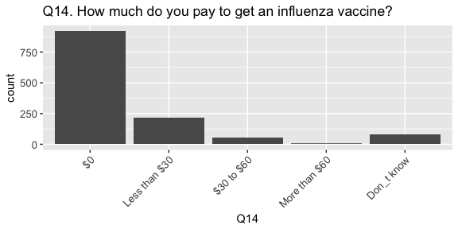<!-- -->

```r
# counts
with(df, addmargins(table(Q14)))
```

```
## Q14
##            $0 Less than $30    $30 to $60 More than $60    Don_t know 
##           970           222            54             4            80 
##           Sum 
##          1330
```


```r
#### Need to subset Q13 by Yes, every year and Yes, some years

## Q14 by Q13: vaccination status

# dropping NAs
head(df[c('CaseID','Q13','Q14')])
```

```
##   CaseID             Q13           Q14
## 1      2 Yes, every year    Don_t know
## 2      3            <NA>          <NA>
## 3      4 Yes, every year            $0
## 4      5 Yes, some years Less than $30
## 5      6 Yes, every year            $0
## 6      7 Yes, some years            $0
```

```r
nrow(df)
```

```
## [1] 2168
```

```r
df_sub <- df[!is.na(df$Q14) & !is.na(df$Q13), ]
head(df_sub[c('CaseID','Q13','Q14')])
```

```
##   CaseID             Q13           Q14
## 1      2 Yes, every year    Don_t know
## 3      4 Yes, every year            $0
## 4      5 Yes, some years Less than $30
## 5      6 Yes, every year            $0
## 6      7 Yes, some years            $0
## 8      9 Yes, every year            $0
```

```r
nrow(df_sub)
```

```
## [1] 1330
```

```r
# count
with(df_sub, addmargins(table(Q14, Q13)))
```

```
##                Q13
## Q14             Yes, every year Yes, some years No, never  Sum
##   $0                        723             247         0  970
##   Less than $30             118             104         0  222
##   $30 to $60                 28              26         0   54
##   More than $60               4               0         0    4
##   Don_t know                 34              46         0   80
##   Sum                       907             423         0 1330
```

```r
# dropping "More than $60" and "No, never"
# need to drop factor instead...
df_sub <- df_sub[!df_sub$Q14=="More than $60" & !df_sub$Q13=="No, never", ]
nrow(df_sub)
```

```
## [1] 1326
```

```r
## update survey object
options(digits = 4)
options(survey.lonely.psu = "adjust")
des14 <- svydesign(ids = ~1, weights = ~weight, data = df_sub)

# updated unweighted count
with(df_sub, addmargins(table(Q14, Q13)))
```

```
##                Q13
## Q14             Yes, every year Yes, some years No, never  Sum
##   $0                        723             247         0  970
##   Less than $30             118             104         0  222
##   $30 to $60                 28              26         0   54
##   More than $60               0               0         0    0
##   Don_t know                 34              46         0   80
##   Sum                       903             423         0 1326
```

```r
# weighted table
#svytable(~Q14 + Q13, des14, round = T)
svyby(~Q14, ~Q13, des14, svymean, na.rm = T)
```

```
##                             Q13  Q14$0 Q14Less than $30 Q14$30 to $60
## Yes, every year Yes, every year 0.7980           0.1345        0.0320
## Yes, some years Yes, some years 0.5793           0.2339        0.0684
##                 Q14More than $60 Q14Don_t know se.Q14$0
## Yes, every year                0       0.03544  0.01455
## Yes, some years                0       0.11830  0.02579
##                 se.Q14Less than $30 se.Q14$30 to $60 se.Q14More than $60
## Yes, every year             0.01263         0.006192                   0
## Yes, some years             0.02171         0.013796                   0
##                 se.Q14Don_t know
## Yes, every year         0.006346
## Yes, some years         0.017462
```

```r
## need to drop factor before running?
#svychisq(~Q14 + Q13, des14)
#a <- glm(Q14 ~ Q13, family = quasibinomial(link = "logit"), data = df_sub, weights = weight)
#summary(a)

# bivariate
title <- ggtitle("Q14. How much do you pay to get an influenza vaccine?")
p <- ggplot(q14, aes(Q14, fill = Q13, weight = Freq)) + ptext + geom_bar() + title
p
```

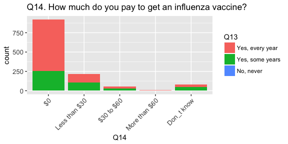<!-- -->


# Q20. How effective do you think the influenza vaccine is in protecting people from becoming sick with influenza?


```r
## Q20. How effective do you think the influenza vaccine is in protecting people from becoming sick with influenza?
q20 <- as.data.frame(svytable(~Q20 + Q13 + ppagecat + PPGENDER + PPETHM + PPEDUCAT, des, round = T))

# univariate
title <- ggtitle("Q20. How effective do you think the influenza vaccine is in protecting people from becoming sick with influenza?")
ggplot(q20, aes(Q20, weight = Freq)) + ptext + geom_bar() + title
```

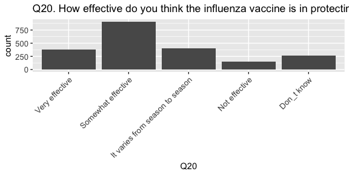<!-- -->

```r
# counts
with(df, addmargins(table(Q20)))
```

```
## Q20
##                  Very effective              Somewhat effective 
##                             383                             961 
## It varies from season to season                   Not effective 
##                             433                             144 
##                      Don_t know                             Sum 
##                             228                            2149
```


```r
### Q20 by Q13: vaccination status ###
# dropping NAs
head(df[c('CaseID','Q13','Q20')])
```

```
##   CaseID             Q13                             Q20
## 1      2 Yes, every year                      Don_t know
## 2      3            <NA>                            <NA>
## 3      4 Yes, every year                  Very effective
## 4      5 Yes, some years It varies from season to season
## 5      6 Yes, every year              Somewhat effective
## 6      7 Yes, some years It varies from season to season
```

```r
nrow(df)
```

```
## [1] 2168
```

```r
df_sub <- df[!is.na(df$Q20) & !is.na(df$Q13), ]
head(df_sub[c('CaseID','Q13','Q20')])
```

```
##   CaseID             Q13                             Q20
## 1      2 Yes, every year                      Don_t know
## 3      4 Yes, every year                  Very effective
## 4      5 Yes, some years It varies from season to season
## 5      6 Yes, every year              Somewhat effective
## 6      7 Yes, some years It varies from season to season
## 7      8       No, never              Somewhat effective
```

```r
nrow(df_sub)
```

```
## [1] 2144
```

```r
## update survey object
options(digits = 4)
options(survey.lonely.psu = "adjust")
des20 <- svydesign(ids = ~1, weights = ~weight, data = df_sub)

# raw count
as.data.frame(with(df_sub, addmargins(table(Q20, Q13))))
```

```
##                                Q20             Q13 Freq
## 1                   Very effective Yes, every year  304
## 2               Somewhat effective Yes, every year  435
## 3  It varies from season to season Yes, every year  141
## 4                    Not effective Yes, every year    6
## 5                       Don_t know Yes, every year   19
## 6                              Sum Yes, every year  905
## 7                   Very effective Yes, some years   45
## 8               Somewhat effective Yes, some years  240
## 9  It varies from season to season Yes, some years   94
## 10                   Not effective Yes, some years   16
## 11                      Don_t know Yes, some years   27
## 12                             Sum Yes, some years  422
## 13                  Very effective       No, never   34
## 14              Somewhat effective       No, never  285
## 15 It varies from season to season       No, never  198
## 16                   Not effective       No, never  120
## 17                      Don_t know       No, never  180
## 18                             Sum       No, never  817
## 19                  Very effective             Sum  383
## 20              Somewhat effective             Sum  960
## 21 It varies from season to season             Sum  433
## 22                   Not effective             Sum  142
## 23                      Don_t know             Sum  226
## 24                             Sum             Sum 2144
```

```r
# weighted table
svyby(~Q13, ~Q20, des20, svymean, na.rm = T)
```

```
##                                                             Q20
## Very effective                                   Very effective
## Somewhat effective                           Somewhat effective
## It varies from season to season It varies from season to season
## Not effective                                     Not effective
## Don_t know                                           Don_t know
##                                 Q13Yes, every year Q13Yes, some years
## Very effective                             0.75960             0.1411
## Somewhat effective                         0.41580             0.2694
## It varies from season to season            0.31195             0.2176
## Not effective                              0.04424             0.1418
## Don_t know                                 0.07811             0.1247
##                                 Q13No, never se.Q13Yes, every year
## Very effective                       0.09934               0.02506
## Somewhat effective                   0.31475               0.01684
## It varies from season to season      0.47042               0.02355
## Not effective                        0.81398               0.01856
## Don_t know                           0.79721               0.01814
##                                 se.Q13Yes, some years se.Q13No, never
## Very effective                                0.02089         0.01751
## Somewhat effective                            0.01567         0.01642
## It varies from season to season               0.02106         0.02554
## Not effective                                 0.03540         0.03832
## Don_t know                                    0.02320         0.02798
```

```r
# chisq
svychisq(~Q20 + Q13, des20)
```

```
## 
## 	Pearson's X^2: Rao & Scott adjustment
## 
## data:  svychisq(~Q20 + Q13, des20)
## F = 57, ndf = 7.9, ddf = 17000.0, p-value <2e-16
```

```r
#a <- glm(Q20 ~ Q13, family = quasibinomial(link = "logit"), data = df_sub, weights = weight)
#summary(a)

# bivariate
ggplot(q20, aes(Q20, fill = Q13, weight = Freq)) + ptext + geom_bar() + title
```

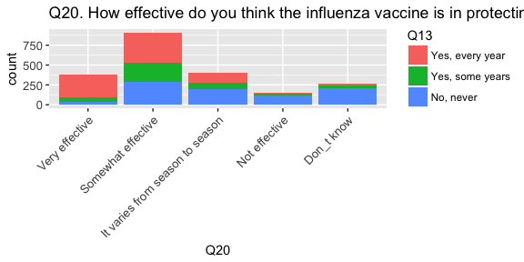<!-- -->


# Q15. Are you more likely to get a vaccine if others around you get a vaccine?


```r
## Q15. Are you more likely to get a vaccine if others around you get a vaccine?
q15 <- as.data.frame(svytable(
  ~Q15 + Q13 + PPGENDER + ppagect4 + PPETHM + income + PPEDUCAT, des14, round = T))

title <- ggtitle("Q15. Are you more likely to get a vaccine if others around you get a vaccine?")
p <- ggplot(q15, aes(Q15, weight = Freq)) + ptext
p + geom_bar() + title
```

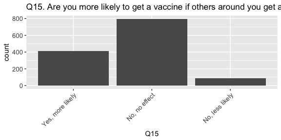<!-- -->


```r
## dropping NAs
head(df[c('CaseID','Q15','Q20')])
```

```
##   CaseID           Q15                             Q20
## 1      2 No, no effect                      Don_t know
## 2      3          <NA>                            <NA>
## 3      4 No, no effect                  Very effective
## 4      5 No, no effect It varies from season to season
## 5      6 No, no effect              Somewhat effective
## 6      7 No, no effect It varies from season to season
```

```r
nrow(df)
```

```
## [1] 2168
```

```r
df_sub <- df[!is.na(df$Q15) & !is.na(df$Q13), ]
head(df_sub[c('CaseID','Q15','Q20')])
```

```
##   CaseID           Q15                             Q20
## 1      2 No, no effect                      Don_t know
## 3      4 No, no effect                  Very effective
## 4      5 No, no effect It varies from season to season
## 5      6 No, no effect              Somewhat effective
## 6      7 No, no effect It varies from season to season
## 8      9 No, no effect                            <NA>
```

```r
nrow(df_sub)
```

```
## [1] 1329
```

```r
## update survey object
options(digits = 4)
options(survey.lonely.psu = "adjust")
des15 <- svydesign(ids = ~1, weights = ~weight, data = df_sub)

# raw count
as.data.frame(with(df, addmargins(table(Q15, Q13))))
```

```
##                 Q15             Q13 Freq
## 1  Yes, more likely Yes, every year  254
## 2     No, no effect Yes, every year  620
## 3   No, less likely Yes, every year   33
## 4               Sum Yes, every year  907
## 5  Yes, more likely Yes, some years  127
## 6     No, no effect Yes, some years  258
## 7   No, less likely Yes, some years   37
## 8               Sum Yes, some years  422
## 9  Yes, more likely       No, never    0
## 10    No, no effect       No, never    0
## 11  No, less likely       No, never    0
## 12              Sum       No, never    0
## 13 Yes, more likely             Sum  381
## 14    No, no effect             Sum  878
## 15  No, less likely             Sum   70
## 16              Sum             Sum 1329
```

```r
#svychisq(~Q15 + Q13, des15)
svyby(~Q13, ~Q15, des15, svymean, na.rm = T)
```

```
##                               Q15 Q13Yes, every year Q13Yes, some years
## Yes, more likely Yes, more likely             0.6418             0.3582
## No, no effect       No, no effect             0.6813             0.3187
## No, less likely   No, less likely             0.4305             0.5695
##                  Q13No, never se.Q13Yes, every year se.Q13Yes, some years
## Yes, more likely            0               0.02698               0.02698
## No, no effect               0               0.01704               0.01704
## No, less likely             0               0.06219               0.06219
##                  se.Q13No, never
## Yes, more likely               0
## No, no effect                  0
## No, less likely                0
```

```r
#a <- glm(Q15 ~ Q13, family = quasibinomial(link = "logit"), data = df, weights = weight)
#summary(a)

# bivariate
ggplot(q15, aes(Q15, fill = Q13, weight = Freq)) + ptext + geom_bar() + title
```

<!-- -->

# Q16. Are you more likely to get a vaccine if others around you do not get a vaccine?


```r
## Q16. Are you more likely to get a vaccine if others around you do not get a vaccine?
q16 <- as.data.frame(svytable(
  ~Q16 + Q13 + PPGENDER + ppagect4 + PPETHM + income + PPEDUCAT, des, round = T))

title <- ggtitle("Q16. Are you more likely to get a vaccine if others around you do not get a vaccine?")
p <- ggplot(q16, aes(Q16, weight = Freq)) + ptext
p + geom_bar() + title
```

<!-- -->


```r
# dropping NAs
head(df[c('CaseID','Q13','Q20')])
```

```
##   CaseID             Q13                             Q20
## 1      2 Yes, every year                      Don_t know
## 2      3            <NA>                            <NA>
## 3      4 Yes, every year                  Very effective
## 4      5 Yes, some years It varies from season to season
## 5      6 Yes, every year              Somewhat effective
## 6      7 Yes, some years It varies from season to season
```

```r
nrow(df)
```

```
## [1] 2168
```

```r
df_sub <- df[!is.na(df$Q20) & !is.na(df$Q13), ]
head(df_sub[c('CaseID','Q13','Q20')])
```

```
##   CaseID             Q13                             Q20
## 1      2 Yes, every year                      Don_t know
## 3      4 Yes, every year                  Very effective
## 4      5 Yes, some years It varies from season to season
## 5      6 Yes, every year              Somewhat effective
## 6      7 Yes, some years It varies from season to season
## 7      8       No, never              Somewhat effective
```

```r
nrow(df_sub)
```

```
## [1] 2144
```

```r
# raw count
as.data.frame(with(df, addmargins(table(Q16, Q13))))
```

```
##                 Q16             Q13 Freq
## 1  Yes, more likely Yes, every year  252
## 2     No, no effect Yes, every year  610
## 3   No, less likely Yes, every year   37
## 4               Sum Yes, every year  899
## 5  Yes, more likely Yes, some years   61
## 6     No, no effect Yes, some years  294
## 7   No, less likely Yes, some years   64
## 8               Sum Yes, some years  419
## 9  Yes, more likely       No, never    0
## 10    No, no effect       No, never    0
## 11  No, less likely       No, never    0
## 12              Sum       No, never    0
## 13 Yes, more likely             Sum  313
## 14    No, no effect             Sum  904
## 15  No, less likely             Sum  101
## 16              Sum             Sum 1318
```

```r
##
#svychisq(~Q16 + Q13, des)
#svyby(~Q16, ~Q13, des, svymean, na.rm = T)
a <- glm(Q16 ~ Q13, family = quasibinomial(link = "logit"), data = df, weights = weight)
summary(a)
```

```
## 
## Call:
## glm(formula = Q16 ~ Q13, family = quasibinomial(link = "logit"), 
##     data = df, weights = weight)
## 
## Deviance Residuals: 
##    Min      1Q  Median      3Q     Max  
## -3.105   0.439   0.659   0.771   1.367  
## 
## Coefficients:
##                    Estimate Std. Error t value Pr(>|t|)    
## (Intercept)          0.8358     0.0743   11.24  < 2e-16 ***
## Q13Yes, some years   0.8518     0.1486    5.73  1.2e-08 ***
## ---
## Signif. codes:  0 '***' 0.001 '**' 0.01 '*' 0.05 '.' 0.1 ' ' 1
## 
## (Dispersion parameter for quasibinomial family taken to be 0.9663)
## 
##     Null deviance: 1434.2  on 1317  degrees of freedom
## Residual deviance: 1399.5  on 1316  degrees of freedom
##   (850 observations deleted due to missingness)
## AIC: NA
## 
## Number of Fisher Scoring iterations: 4
```

```r
###
svytable(~Q16 + Q13, des14, round = T)
```

```
##                   Q13
## Q16                Yes, every year Yes, some years No, never
##   Yes, more likely             249              69         0
##   No, no effect                535             295         0
##   No, less likely               40              79         0
```

```r
svyby(~Q16, ~Q13, des14, svymean, na.rm=T)
```

```
##                             Q13 Q16Yes, more likely Q16No, no effect
## Yes, every year Yes, every year              0.3021           0.6495
## Yes, some years Yes, some years              0.1561           0.6664
##                 Q16No, less likely se.Q16Yes, more likely
## Yes, every year            0.04838                0.01693
## Yes, some years            0.17749                0.01971
##                 se.Q16No, no effect se.Q16No, less likely
## Yes, every year             0.01754              0.008286
## Yes, some years             0.02552              0.021335
```

```r
# bivariate
ggplot(q16, aes(Q16, fill = Q13, weight = Freq)) + ptext + geom_bar() + title
```

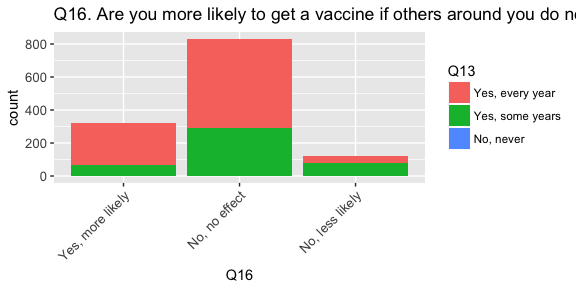<!-- -->


# Q17. Do you get a vaccine to protect yourself, protect others, or protect yourself and others?


```r
## Q17. Do you get a vaccine to protect yourself, protect others, or protect yourself and others?
q17 <- as.data.frame(svytable(
  ~Q17 + Q13 + PPGENDER + ppagect4 + PPETHM + income + PPEDUCAT, des, round = T))

title <- ggtitle("Q17. Do you get a vaccine to protect yourself, protect others, or protect yourself and others?")
p <- ggplot(q17, aes(Q17, weight = Freq)) + ptext
p + geom_bar() + title
```

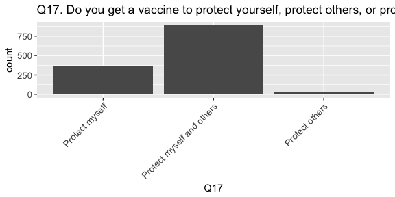<!-- -->


```r
##
#svychisq(~Q17 + Q13, des)
#svyby(~Q17, ~Q13, des, svymean, na.rm = F)
a <- glm(Q17 ~ Q13, family = quasibinomial(link = "logit"), data = df, weights = weight)
summary(a)
```

```
## 
## Call:
## glm(formula = Q17 ~ Q13, family = quasibinomial(link = "logit"), 
##     data = df, weights = weight)
## 
## Deviance Residuals: 
##    Min      1Q  Median      3Q     Max  
## -2.485  -1.244   0.678   0.824   1.417  
## 
## Coefficients:
##                    Estimate Std. Error t value Pr(>|t|)    
## (Intercept)          1.0409     0.0776   13.41   <2e-16 ***
## Q13Yes, some years  -0.2917     0.1263   -2.31    0.021 *  
## ---
## Signif. codes:  0 '***' 0.001 '**' 0.01 '*' 0.05 '.' 0.1 ' ' 1
## 
## (Dispersion parameter for quasibinomial family taken to be 0.9646)
## 
##     Null deviance: 1517.0  on 1323  degrees of freedom
## Residual deviance: 1511.9  on 1322  degrees of freedom
##   (844 observations deleted due to missingness)
## AIC: NA
## 
## Number of Fisher Scoring iterations: 4
```

```r
# raw count
as.data.frame(with(df, addmargins(table(Q17, Q13))))
```

```
##                          Q17             Q13 Freq
## 1             Protect myself Yes, every year  243
## 2  Protect myself and others Yes, every year  653
## 3             Protect others Yes, every year    6
## 4                        Sum Yes, every year  902
## 5             Protect myself Yes, some years  138
## 6  Protect myself and others Yes, some years  268
## 7             Protect others Yes, some years   16
## 8                        Sum Yes, some years  422
## 9             Protect myself       No, never    0
## 10 Protect myself and others       No, never    0
## 11            Protect others       No, never    0
## 12                       Sum       No, never    0
## 13            Protect myself             Sum  381
## 14 Protect myself and others             Sum  921
## 15            Protect others             Sum   22
## 16                       Sum             Sum 1324
```

```r
# dropping NAs
head(df[c('CaseID','Q13','Q20')])
```

```
##   CaseID             Q13                             Q20
## 1      2 Yes, every year                      Don_t know
## 2      3            <NA>                            <NA>
## 3      4 Yes, every year                  Very effective
## 4      5 Yes, some years It varies from season to season
## 5      6 Yes, every year              Somewhat effective
## 6      7 Yes, some years It varies from season to season
```

```r
nrow(df)
```

```
## [1] 2168
```

```r
df_sub <- df[!is.na(df$Q20) & !is.na(df$Q13), ]
head(df_sub[c('CaseID','Q13','Q20')])
```

```
##   CaseID             Q13                             Q20
## 1      2 Yes, every year                      Don_t know
## 3      4 Yes, every year                  Very effective
## 4      5 Yes, some years It varies from season to season
## 5      6 Yes, every year              Somewhat effective
## 6      7 Yes, some years It varies from season to season
## 7      8       No, never              Somewhat effective
```

```r
nrow(df_sub)
```

```
## [1] 2144
```

```r
#####
svytable(~Q17 + Q13, des14, round = T)
```

```
##                            Q13
## Q17                         Yes, every year Yes, some years No, never
##   Protect myself                        214             143         0
##   Protect myself and others             604             282         0
##   Protect others                          6              21         0
```

```r
svyby(~Q17, ~Q13, des14, svymean, na.rm = T)
```

```
##                             Q13 Q17Protect myself
## Yes, every year Yes, every year            0.2602
## Yes, some years Yes, some years            0.3210
##                 Q17Protect myself and others Q17Protect others
## Yes, every year                       0.7330          0.006744
## Yes, some years                       0.6324          0.046638
##                 se.Q17Protect myself se.Q17Protect myself and others
## Yes, every year              0.01545                         0.01561
## Yes, some years              0.02420                         0.02522
##                 se.Q17Protect others
## Yes, every year             0.003131
## Yes, some years             0.012280
```

```r
# bivariate
ggplot(q17, aes(Q17, fill = Q13, weight = Freq)) + ptext + geom_bar() + title
```

<!-- -->


# Q18. What are the reasons you would not get an influenza vaccine?


```r
## Q18. What are the reasons you would not get an influenza vaccine?

title <- ggtitle("Q18. What are the reasons you would not get an influenza vaccine?")

##
#svychisq(~Q18 + Q13, des)
#svyby(~Q18, ~Q13, des, svymean, na.rm = F)
#a <- glm(Q18 ~ Q13, family = quasibinomial(link = "logit"), data = df, weights = weight)
#summary(a)
```


# Q19. Do you have health insurance?


```r
## Q19. Do you have health insurance?
q19 <- as.data.frame(svytable(
  ~Q19 + Q13 + PPGENDER + ppagect4 + PPETHM + income + PPEDUCAT, des, round = T))

title <- ggtitle("Q19. Do you have health insurance?")
p <- ggplot(q19, aes(Q19, weight = Freq)) + ptext
p + geom_bar() + title
```

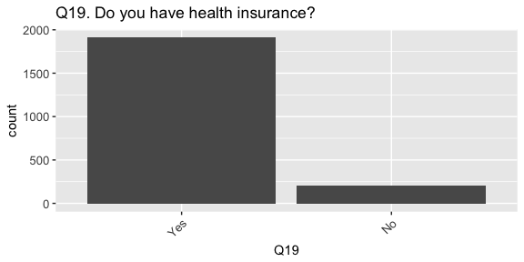<!-- -->


```r
# raw count
as.data.frame(with(df, addmargins(table(Q19, Q13))))
```

```
##    Q19             Q13 Freq
## 1  Yes Yes, every year  887
## 2   No Yes, every year   19
## 3  Sum Yes, every year  906
## 4  Yes Yes, some years  396
## 5   No Yes, some years   24
## 6  Sum Yes, some years  420
## 7  Yes       No, never  708
## 8   No       No, never  110
## 9  Sum       No, never  818
## 10 Yes             Sum 1991
## 11  No             Sum  153
## 12 Sum             Sum 2144
```

```r
# weighted prop
svyby(~Q13, ~Q19, des, svymean, na.rm = T)
```

```
##     Q19 Q13Yes, every year Q13Yes, some years Q13No, never
## Yes Yes             0.4184             0.2119       0.3696
## No   No             0.1131             0.1638       0.7231
##     se.Q13Yes, every year se.Q13Yes, some years se.Q13No, never
## Yes               0.01176               0.01002         0.01171
## No                0.02636               0.03314         0.03905
```

```r
svychisq(~Q19 + Q13, des)
```

```
## 
## 	Pearson's X^2: Rao & Scott adjustment
## 
## data:  svychisq(~Q19 + Q13, des)
## F = 35, ndf = 2, ddf = 4300, p-value = 1e-15
```

```r
# bivariate
ggplot(q19, aes(Q19, fill = Q13, weight = Freq)) + ptext + geom_bar() + title
```

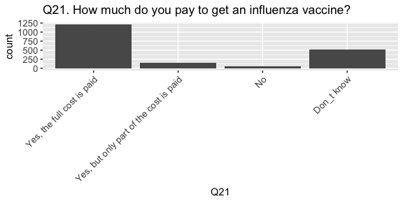<!-- -->

# Q21. Are influenza vaccines covered by your insurance?


```r
### Subset by Q19 = Yes

## Q21. Are influenza vaccines covered by your insurance?
q21 <- as.data.frame(svytable(
  ~Q21 + Q13 + PPGENDER + ppagect4 + PPETHM + income + PPEDUCAT, des, round = T))

title <- ggtitle("Q21. Are influenza vaccines covered by your health insurance?")
p <- ggplot(q21, aes(Q21, weight = Freq)) + ptext
p + geom_bar() + title
```

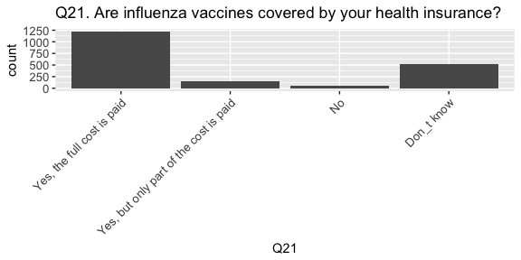<!-- -->


```r
# raw count
as.data.frame(with(df, addmargins(table(Q21, Q13))))
```

```
##                                       Q21             Q13 Freq
## 1              Yes, the full cost is paid Yes, every year  731
## 2  Yes, but only part of the cost is paid Yes, every year   61
## 3                                      No Yes, every year   19
## 4                              Don_t know Yes, every year   75
## 5                                     Sum Yes, every year  886
## 6              Yes, the full cost is paid Yes, some years  249
## 7  Yes, but only part of the cost is paid Yes, some years   47
## 8                                      No Yes, some years   13
## 9                              Don_t know Yes, some years   86
## 10                                    Sum Yes, some years  395
## 11             Yes, the full cost is paid       No, never  301
## 12 Yes, but only part of the cost is paid       No, never   44
## 13                                     No       No, never   23
## 14                             Don_t know       No, never  339
## 15                                    Sum       No, never  707
## 16             Yes, the full cost is paid             Sum 1281
## 17 Yes, but only part of the cost is paid             Sum  152
## 18                                     No             Sum   55
## 19                             Don_t know             Sum  500
## 20                                    Sum             Sum 1988
```

```r
# subset data


# weighted props
svyby(~Q13, ~Q21, des, svymean, na.rm = T)
```

```
##                                                                           Q21
## Yes, the full cost is paid                         Yes, the full cost is paid
## Yes, but only part of the cost is paid Yes, but only part of the cost is paid
## No                                                                         No
## Don_t know                                                         Don_t know
##                                        Q13Yes, every year
## Yes, the full cost is paid                         0.5448
## Yes, but only part of the cost is paid             0.3625
## No                                                 0.3633
## Don_t know                                         0.1461
##                                        Q13Yes, some years Q13No, never
## Yes, the full cost is paid                         0.2074       0.2478
## Yes, but only part of the cost is paid             0.3455       0.2920
## No                                                 0.2357       0.4010
## Don_t know                                         0.1822       0.6717
##                                        se.Q13Yes, every year
## Yes, the full cost is paid                           0.01499
## Yes, but only part of the cost is paid               0.04132
## No                                                   0.06976
## Don_t know                                           0.01668
##                                        se.Q13Yes, some years
## Yes, the full cost is paid                           0.01242
## Yes, but only part of the cost is paid               0.04323
## No                                                   0.06140
## Don_t know                                           0.01852
##                                        se.Q13No, never
## Yes, the full cost is paid                     0.01316
## Yes, but only part of the cost is paid         0.04009
## No                                             0.07143
## Don_t know                                     0.02239
```

```r
#svychisq(~Q21 + Q13, des)

# bivariate
ggplot(q21, aes(Q21, fill = Q13, weight = Freq)) + ptext + geom_bar() + title
```

<!-- -->


# Regression model


```r
# Q13
library(MASS)
library(broom)
m <- polr(Q13 ~ Q1, weights = df$weight, data = df, Hess=TRUE)
summary(m)
```

```
## Call:
## polr(formula = Q13 ~ Q1, data = df, weights = df$weight, Hess = TRUE)
## 
## Coefficients:
##      Value Std. Error t value
## Q1No 0.864     0.0971    8.89
## 
## Intercepts:
##                                 Value  Std. Error t value
## Yes, every year|Yes, some years -0.261  0.049     -5.285 
## Yes, some years|No, never        0.617  0.051     12.118 
## 
## Residual Deviance: 4451.06 
## AIC: 4457.06 
## (24 observations deleted due to missingness)
```

```r
#exp(m$coefficients)
#coef(summary(m))

danresults <- tidy(coef(summary(m)))
danresults$OR <- exp(danresults$Value)
danresults$ORupper <- exp(danresults$Value + 1.96*danresults$Std..Error)
danresults$ORlower <- exp(danresults$Value - 1.96*danresults$Std..Error)
danresults
```

```
##                         .rownames   Value Std..Error t.value     OR
## 1                            Q1No  0.8637    0.09714   8.891 2.3718
## 2 Yes, every year|Yes, some years -0.2609    0.04936  -5.285 0.7704
## 3       Yes, some years|No, never  0.6170    0.05092  12.118 1.8534
##   ORupper ORlower
## 1  2.8692  1.9606
## 2  0.8486  0.6994
## 3  2.0479  1.6774
```

Q13. Do you get the flu vaccine?
Q14. How much do you pay to get an influenza vaccine?
Q15. Are you more likely to get a vaccine if others around you get a vaccine?
Q16. Are you more likely to get a vaccine if others around you do not get a vaccine?
Q17. Do you get a vaccine to protect yourself, protect others, or protect yourself and others?
Q18. What are the reasons you would not get an influenza vaccine?
Q19. Do you have health insurance?
Q20. How effective do you think the influenza vaccine is in protecting people from becoming sick with influenza?
Q21. Are influenza vaccines covered by your insurance?
