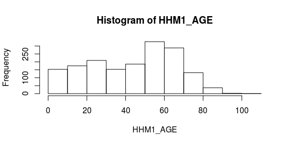
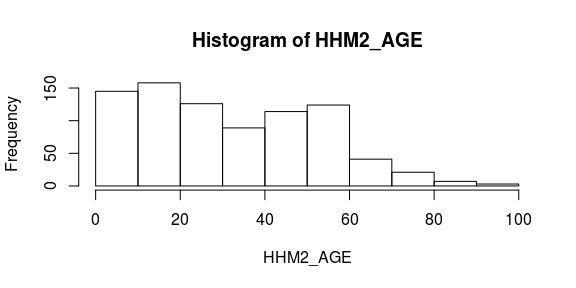
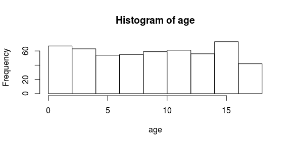
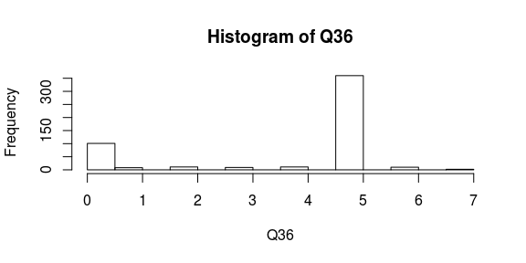
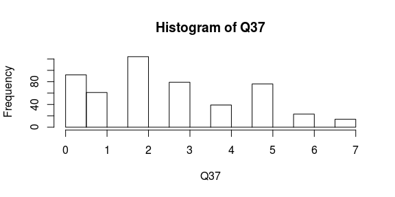
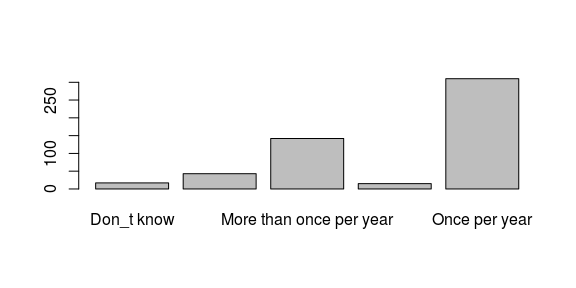
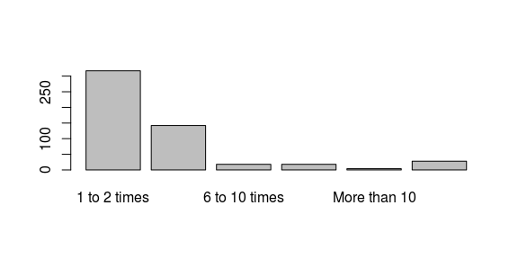
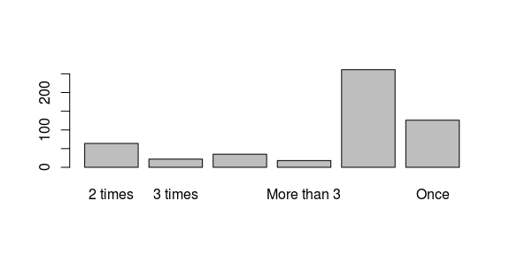
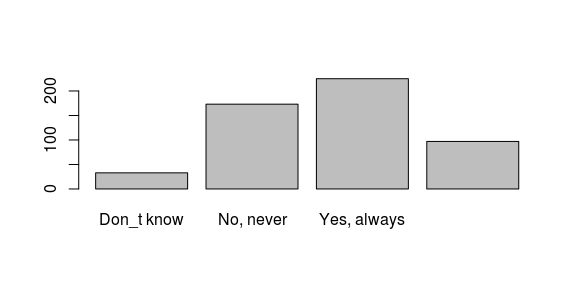

# Household members

This report contains survey data analysis for household members.


All household members.


```r
data2 <- dat
names(dat[407:417])
```

```
##  [1] "Q35"       "Q36"       "Q36_Codes" "Q37"       "Q37_Codes"
##  [6] "Q38"       "Q38_Codes" "Q39"       "Q40"       "Q41"      
## [11] "Q42"
```

```r
# select respondent's education, race, income, location + household data
data_hhm1 <- data2 %>%
  select(c(PPEDUCAT, PPETHM, PPINCIMP, ppreg9, PPSTATEN, 374:375, 407:417)) %>%
  filter(!is.na(HHM1_AGE))

data_hhm2 <- data2 %>%
  select(c(PPEDUCAT, PPETHM, PPINCIMP, ppreg9, PPSTATEN, 405:406, 418:428)) %>%
  filter(!is.na(HHM2_AGE))

# all ages histogram
with(data_hhm1, hist(HHM1_AGE))
```

<!-- -->

```r
with(data_hhm2, hist(HHM2_AGE))
```

<!-- -->

Household children.
- includes respondent's education, race, income, location
- join/merge hhm1 and hhm2 into single dataframe


```r
# subset children < age 18
child1 <- data_hhm1 %>%
  filter(HHM1_AGE < 18)
child2 <- data_hhm2 %>%
  filter(HHM2_AGE < 18)

# count total number of children <18 years
child1 %>%
  group_by(HHM1_AGE) %>%
  summarise(n = n()) %>%
  summarise(sum(n))
```

```
## # A tibble: 1 x 1
##   sum(n)
##    <int>
## 1    270
```

```r
child2 %>%
  group_by(HHM2_AGE) %>%
  summarise(n = n()) %>%
  summarise(sum(n))
```

```
## # A tibble: 1 x 1
##   sum(n)
##    <int>
## 1    260
```

```r
# append dataframes, rename columns to be the same
nam <- c("PPEDUCAT", "PPETHM", "PPINCIMP", "ppreg9", "PPSTATEN", "age", "name", "gender",
         "Q36", "Q36_Codes", "Q37", "Q37_Codes", "Q38", "Q38_Codes",
         "Q39", "Q40", "Q41", "Q42")
names(child1) <- nam
names(child2) <- nam

children <- rbind(child1, child2)

rm(data_hhm1, data_hhm2, child1, child2)
```

Total number of children = 270 + 260 = 530


```r
# age histogram
with(children, hist(age))
```

<!-- -->


# Survey questions
### Q35. What is the gender of this member of the household?


```r
with(children, summary(gender))
```

```
## Female   Male   NA's 
##    263    261      6
```

### Q36. On average, how many days per week does this member of your household work or attend day care or school outside of your home?


```r
with(children, hist(Q36))
```

<!-- -->

```r
with(children, summary(Q36))
```

```
##    Min. 1st Qu.  Median    Mean 3rd Qu.    Max.    NA's 
##   0.000   3.000   5.000   3.857   5.000   7.000      18
```

### Q37. On average, how many days per week does this member of your household participate in social activities outside of your home?


```r
with(children, hist(Q37))
```

<!-- -->

```r
with(children, summary(Q37))
```

```
##    Min. 1st Qu.  Median    Mean 3rd Qu.    Max.    NA's 
##   0.000   1.000   2.000   2.594   4.000   7.000      22
```

### Q38. On average, how many days per week does this member of your household use public transportation?


```r
with(children, hist(Q38))
```

<!-- -->

```r
with(children, summary(Q38))
```

```
##    Min. 1st Qu.  Median    Mean 3rd Qu.    Max.    NA's 
##  0.0000  0.0000  0.0000  0.7949  0.0000  6.0000      23
```

### Q39. How frequently does this member of your household visit a doctor's office for wellness appointments?


```r
with(children, summary(Q39))
```

```
##              Don_t know Less than once per year More than once per year 
##                      17                      43                     142 
##                   Never           Once per year                    NA's 
##                      15                     310                       3
```

```r
with(children, barplot(table(Q39)))
```

<!-- -->

### Q40. How frequently does this member of the household get sick in a typical year?


```r
with(children, summary(Q40))
```

```
##  1 to 2 times  3 to 5 times 6 to 10 times    Don_t know  More than 10 
##           317           142            18            18             4 
##         Never          NA's 
##            28             3
```

```r
with(children, barplot(table(Q40)))
```

<!-- -->


### Q41. How many times has this member of your household had influenza or another respiratory illness in the last two years?


```r
with(children, summary(Q41))
```

```
##     2 times     3 times  Don_t know More than 3       Never        Once 
##          64          22          35          18         261         126 
##        NA's 
##           4
```

```r
with(children, barplot(table(Q41)))
```

<!-- -->


### Q42. Does this member of your household get an annual influenza vaccine?


```r
with(children, summary(Q42))
```

```
##     Don_t know      No, never    Yes, always Yes, sometimes           NA's 
##             33            173            225             97              2
```

```r
with(children, barplot(table(Q42)))
```

<!-- -->

```r
# vaccine by age
with(children, table(age, Q42))
```

```
##     Q42
## age  Don_t know No, never Yes, always Yes, sometimes
##   0           2         9           3              2
##   1           2         5          22              4
##   2           3         5           8              1
##   3           3         9          20              3
##   4           2         6          16              4
##   5           1        11          13              3
##   6           3         6          11              6
##   7           1         9          10              5
##   8           1         7          13              8
##   9           2         7          11              5
##   10          2        11          14              7
##   11          1         9          16              3
##   12          1        16           8              7
##   13          1        10          13              6
##   14          2        11           8              5
##   15          1         9          16              9
##   16          2        17          11              8
##   17          3        16          12             11
```

```r
# regroup variables
```


